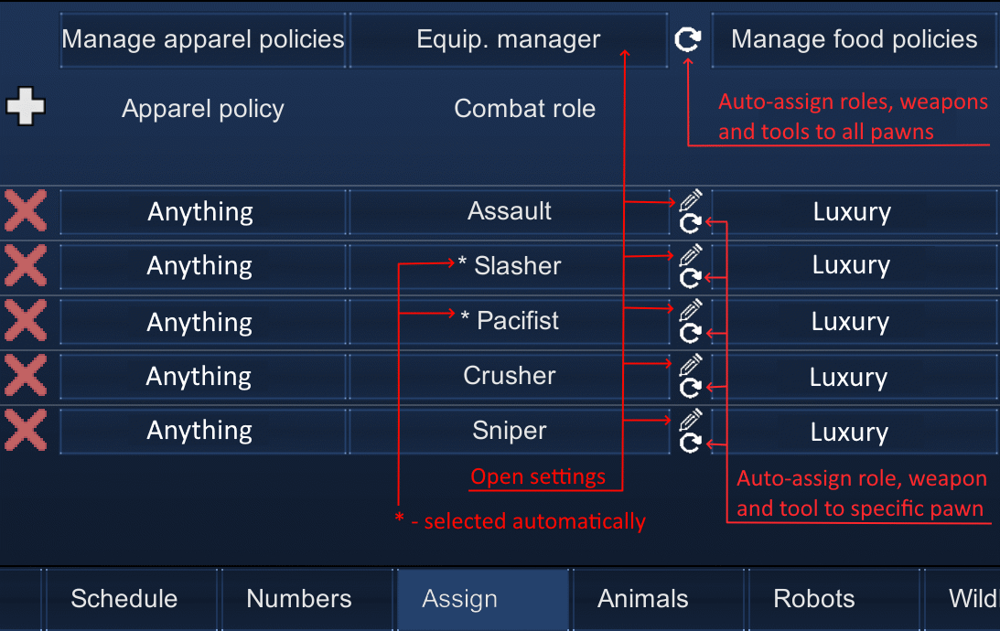

# EquipManager-HSK

[Download Latest Release](https://github.com/MVA101607/equipmanager-HSK/releases/latest/download/EquipManager-HSK.zip)

## English
A rework of the Equipment Manager mod by LordKuper / Michieru.
SimpleSidearms integration has been removed. CE (Extended Loadout) integration has been added instead.

The mod searches for the best weapon based on stats, assigns it to a pawn's personal loadout, adds ammo, and then directs the pawn to grab that best weapon.

You can set up different weapon selection policies — a sniper will choose a long-range weapon, an assault will choose a rapid-fire weapon, etc.
The same applies to melee weapons.

## Russian / Русский
Переработка мода Equipment Manager от LordKuper / Michieru.
Убрана интеграция SimpleSidearms. Вместо неё добавлена интеграция CE - Extended Loadout.

Мод ищет лучшее оружие по статам, прописывает его в личную разгрузку(loadout) пешке, докидывает еще туда патронов и гонит пешку подбирать данный лучший экземпляр. 

Можно настраивать разные политики для выбора оружия - снайпер возьмет дальнобойное, штурмовик - скорострельное и т.д.
Аналогично с холодным оружием.